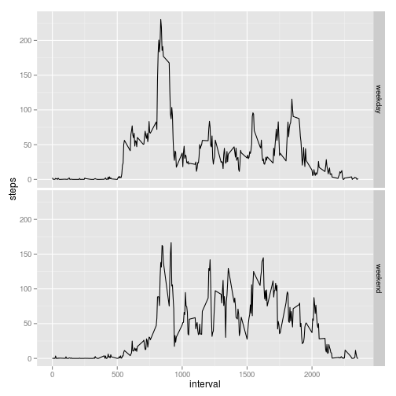

## Loading and preprocessing the data

- Loading the data


```r
unzip('activity.zip')
act <- read.csv('activity.csv')
head(act)
```

```
##   steps       date interval
## 1    NA 2012-10-01        0
## 2    NA 2012-10-01        5
## 3    NA 2012-10-01       10
## 4    NA 2012-10-01       15
## 5    NA 2012-10-01       20
## 6    NA 2012-10-01       25
```


## What is mean total number of steps taken per day?

- Histogram of the total number of steps taken each day


```r
hist(act$steps)
```

 

- **Mean** and **median** total number of steps taken per day


```r
mean(act$steps, na.rm = TRUE)
```

```
## [1] 37.3826
```

```r
median(act$steps, na.rm = TRUE)
```

```
## [1] 0
```


## What is the average daily activity pattern?

- Time series plot of the 5-minute interval (x-axis) and the average number of steps taken, averaged across all days (y-axis)


```r
actagg<-aggregate(act$steps, by=list(act$interval), FUN=mean, na.rm=TRUE)
names(actagg)<-c('interval','steps')
plot(actagg$interval, actagg$steps, type="l")
```

 

- Which 5-minute interval, on average across all the days in the dataset, contains the maximum number of steps?


```r
actagg[actagg$steps==max(actagg$steps),]
```

```
##     interval    steps
## 104      835 206.1698
```


## Imputing missing values

- Calculate and report the total number of missing values in the dataset


```r
dim(act[is.na(act$steps),])[1]
```

```
## [1] 2304
```

- Devise a strategy for filling in all of the missing values in the dataset

  The strategy chosen to fill the missing values in the dataset is to include the
  mean value for the 5-minute interval already calculated
  in the `actagg` valiable
  
- Create a new dataset that is equal to the original dataset but with the missing data filled in.


```r
nact<-act
for(i in 1:nrow(nact)) {
  if(is.na(nact[i,1])) { 
    nact[i,1] <- actagg$steps[actagg$interval==nact[i,3]]
  }
}
```

- Make a histogram of the total number of steps taken each day


```r
hist(nact$steps)
```

 

- Calculate and report the mean and median total number of steps taken per day


```r
mean(nact$steps)
```

```
## [1] 37.3826
```

```r
median(nact$steps)
```

```
## [1] 0
```

- Do these values differ from the estimates from the first part of the assignment? What is the impact of imputing missing data on the estimates of the total daily number of steps?

  Based on the mean and median calculated above, we conclude that the mean and median have not changed from the initial dataset.
  
  Based on the sums calculated above, we can see that there is some impact for inputing mean values for the missing values on the estimates of the total daily number of steps.
  

```r
sum(act$steps, na.rm = TRUE)
```

```
## [1] 570608
```

```r
sum(nact$steps, na.rm = TRUE)
```

```
## [1] 656737.5
```

## Are there differences in activity patterns between weekdays and weekends?

- Create a new factor variable in the dataset with two levels – “weekday” and “weekend” indicating whether a given date is a weekday or weekend day.


```r
nact$weekday <- weekdays(as.Date(nact$date))
nact$wd <- as.POSIXlt(nact$date)$wday
# 0 - sunday, #6 - saturday
nact$daytype <- NULL
for(i in 1:nrow(nact)) {
  if(nact$wd[i] %in% c(0,6)) {
    nact$daytype[i] <- "weekend"
  }
  else {
    nact$daytype[i] <- "weekday"    
  }
}

nactagg<-aggregate(nact$steps, by=list(nact$interval, nact$daytype), FUN=mean, na.rm=TRUE)
names(nactagg)<-c('interval','daytype','steps')
```

- Make a panel plot containing a time series plot of the 5-minute interval (x-axis) and the average number of steps taken, averaged across all weekday days or weekend days (y-axis).


```r
library(ggplot2)
qplot(interval, steps, data=nactagg, geom="path", facets = daytype ~.)
```

 

